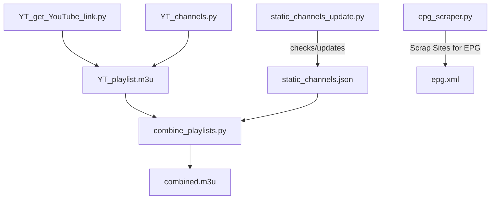

# 📺 IPTV

---

**IPTV Playlist & EPG Manager**

This project is a lightweight yet powerful IPTV playlist and EPG manager, designed as a **personal coding project** to maintain a reliable IPTV setup for **personal use**. All included links are collected from publicly available sources and other GitHub repositories.

I **do not host or distribute any copyrighted content**. This project is purely intended for **educational and personal use**, helping users organize and manage IPTV playlists and EPG data efficiently. All resources provided are sourced from publicly accessible platforms, ensuring compliance with copyright regulations.

**⚡ Key Features**

* 📺 Seamless IPTV playlist management
* 🗓 Integrated EPG for a richer viewing experience
* 🖥 Intuitive interface for personal IPTV setups
* 🌐 Fully sourced from publicly available platforms, ensuring legal compliance

**Note:** This project is intended **strictly for personal and educational use**. All content is collected from public sources.

---

## 🚀 Features

- ✅ **Playlist Aggregation** – Combines multiple `combined.m3u` playlists into one.
- ✅ **Static Channel Updates** – Automatically check working channel static channels from `static_channels.json`.
- ✅ **EPG Scraper** – Generates or updates `epg.xml` for TV guide support.
- ✅ **YouTube Playlist Support** – Automatically save live channels from YouTube in `YT_playlist.m3u`.
- ✅ **Fully Automated** – CI/CD workflows can regenerate playlists and guides.

---

## 🗂 Project Structure

```
IPTV/
├── .github/workflows/         # CI/CD pipelines for automation
├── YT_channels.py             # YouTube channels list
├── YT_get_YouTube_link.py     # Get m3u8 links from YouTube
├── combine_playlists.py       # Combines YouTube and static channels playlist into one
├── epg_scraper.py             # Scrapes and generates EPG (XML format)
├── static_channels_update.py  # Updates static channels status automatically
├── static_channels.json       # Predefined static channels (outpot)
├── YT_playlist.m3u            # Playlist generated from Youtube (output)
├── combined.m3u               # Final generated playlist (output)
└── epg.xml                    # Final generated TV guide (output)
```

---

## 📊 Workflow Diagram



---

## ⚙️ Installation & Usage

1. **Clone the repository:**
   ```bash
   git clone https://github.com/time2shine/IPTV.git
   cd IPTV
   ```

2. **Install dependencies:**
   ```bash
   pip install -r requirements.txt
   ```

3. **Generate Playlist & EPG:**
   ```bash
   python main.py
   ```

4. **Find outputs:**
   - `combined.m3u` → your IPTV playlist
   - `epg.xml` → your TV guide

---

## 🖼 Example Output

**Sample combined.m3u:**
```m3u
#EXTM3U
#EXTINF:-1 tvg-id="BBCWORLD" group-title="News",BBC World News
http://example.com/stream/bbcworld
```

---

## 🛠 For Developers

- Add new channels by editing `static_channels.json`.
- Modify playlist combination rules in `combine_playlists.py`.
- Extend EPG scraping logic in `epg_scraper.py` for custom sources.

---

## 🤝 Contributing

Contributions are welcome! Fork the repo, make your changes, and submit a PR.

---

## 📜 License

MIT License – free to use, modify, and share.

---

## ❤️ Maintainer Notes

This project is maintained as a **hobby** and for family use. It's a fun way to keep learning Python while keeping IPTV streams organized for daily use.

